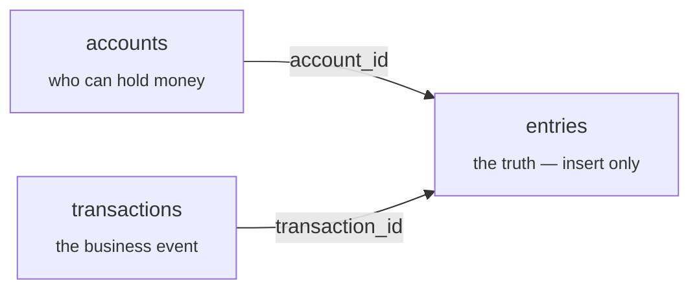
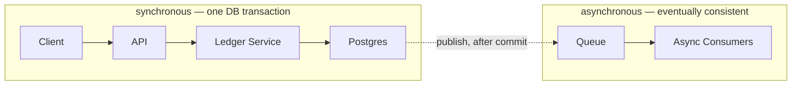

# My-Custom-Ledger-Design

A double-entry ledger service (Java 21 / Spring Boot 3.3.4 / Postgres 16), built as interview-style system-design practice.

> Full interactive design notebook (with diagrams, tabs, and styling): https://claude.ai/artifact/GVSwh4StpPJCNZbvRMyz6K
>
> The notes below are that notebook's content in plain Markdown, kept here so it travels with the repo.

---

## Ledger Design Notebook

*Revision notes · double-entry ledger service. The full design walk — requirements through concurrency — condensed for revision. Every section ends with the tradeoffs that mattered and the line to actually say out loud in the interview.*

### 00 · What this question is actually grading

A "design a ledger" question looks open-ended, but interviewers are almost always checking for six specific things. If these six are solid, the rest (API shape, sharding, etc.) is polish.

1. **Double-entry bookkeeping** — every transaction's entries sum to zero.
2. **Immutability** — the ledger is append-only; nothing is ever `UPDATE`d or deleted.
3. **Idempotency** — a retried request must not double-post.
4. **Concurrency correctness** — two writers touching one account can't both win.
5. **Derived vs. stored balance** — knowing which one is the source of truth.
6. **Consistency model** — being able to defend "strong consistency" as a deliberate choice, not a default.

> **Say this in the interview:** Before designing anything, state the scope out loud and propose numbers instead of waiting to be asked — it reads as experience, not guessing.

### 01 · Requirements

*Scope it before you design it.*

**Functional**
- Create an **account** (user, merchant, or internal — `platform:fees`, `platform:revenue`).
- Post a **transaction**: money moves between ≥2 accounts, always balanced.
- Get an account's current **balance**.
- Get an account's **statement** (paginated entry history).
- "Undo" a transaction by posting a **reversal** — never edit history.

**Non-functional**
- **Correctness > availability > latency.** This explicitly rejects "eventual consistency is fine."
- **Idempotency** required on every write.
- **Auditability** — nothing hard-deleted, full history reconstructable.
- **Durability** — a returned "success" must never be lost (ACID commit).
- Concrete scale target to anchor the design: **~1,000 TPS**, single Postgres-class DB to start.

**Out of scope (say this out loud too)**
- Multi-currency FX conversion
- Multi-region active-active
- External bank rails (ACH/wire) — this models the *internal* ledger only

> **Standard assumption to state:** `USER` accounts get a `min_balance = 0` floor enforced at write time. `PLATFORM` / `REVENUE` accounts have no floor. `CLEARING`/suspense accounts specifically *need* to go negative transiently — money can be "owed" before settlement completes.

### 02 · Data model

*Entries are the source of truth.*

The single most important decision in the whole problem: **the ledger entries are the source of truth — `account.balance` is a derived, cached number.** Get this backwards and audit, concurrency, and reconciliation all break later.



Every entry is pinned to one account and one transaction. Nothing but `entries` is ever inserted with money attached.

**Schema**

| Table | Fields |
|---|---|
| `accounts` | `id` uuid PK · `name` · `type` USER/PLATFORM/CLEARING/REVENUE · `currency` · `created_at` |
| `transactions` | `id` uuid PK · `idempotency_key` UNIQUE · `request_hash` · `status` POSTED/REVERSED · `created_at` |
| `entries` | `id` uuid PK · `sequence_number` BIGSERIAL · `transaction_id` FK · `account_id` FK · `amount` signed, minor units |
| `balances` (materialized cache) | `account_id` PK/FK · `balance` · `updated_at` — kept in sync *in the same DB transaction* as the entry insert |

**Why entries, not just `accounts.balance`**

| Only `accounts.balance` | Immutable `entries` |
|---|---|
| No audit trail — can't answer "how did we get to $500?" | Full history — replay entries, get the balance at any point in time |
| Concurrent updates race on one row | Entries are insert-only — nothing to race on there |
| A bug that corrupts a balance is undetectable | Reconciliation job can diff `SUM(entries)` vs. cached balance and catch drift |
| Fixing a mistake means editing history | Reversal = a new, inverted transaction — history stays truthful |

**Two decisions worth defending explicitly**

| Decision | Chose | Why / alternative |
|---|---|---|
| Amount representation | signed amount (one column) | Simpler invariant to check (`sum = 0`). Production systems often use separate non-negative `debit_amount`/`credit_amount` columns instead — avoids sign-flip bugs, matches how accountants think. Worth naming as the "more real" alternative. |
| Money type | `long`, minor units (cents) | Never float/double — an instant red flag in this kind of interview. |

> **Gotcha:** A random UUID primary key (`entries.id`) does **not** preserve insertion order — `ORDER BY id` silently gives you the wrong "history." Cursor pagination needs a real monotonic column (a `BIGSERIAL sequence_number`), not the UUID.

> **Say this in the interview:** "The account balance is a cache. The entries are the ledger." — say this sentence early; it signals you know where the interview is actually going.

### 03 · API design

*No `PUT` or `PATCH` anywhere near money.*

| Endpoint | Purpose |
|---|---|
| `POST /v1/accounts` | create an account |
| `GET /v1/accounts/{id}` | account details |
| `GET /v1/accounts/{id}/balance` | current (cached) balance |
| `GET /v1/accounts/{id}/entries` | paginated statement, cursor-based |
| `POST /v1/transactions` | the core write — post a transaction |
| `GET /v1/transactions/{id}` | transaction + its entries |
| `POST /v1/transactions/{id}/reverse` | post a new, inverted transaction |

No `PUT`/`PATCH` anywhere — that's immutability enforced by the API surface itself, not just a convention.

**Request shape.** `entries` is a **list**, not a fixed `from`/`to` pair — a real transaction might be 3-way ("customer pays $100 → $97 merchant, $3 platform fee"), all still summing to zero.

**Idempotency, precisely**
- `Idempotency-Key` header (not body) — `UNIQUE` constraint on `transactions.idempotency_key`.
- Retry with a seen key → **don't reprocess**, return the stored result.
- Same key, *different* payload → hash the body, compare, return `409 Conflict` — a client bug, not a valid retry.

**Errors**
- **400** — shape is wrong: entries don't sum to zero, fewer than 2 entries, unknown account.
- **422** — insufficient funds. Can only be detected *inside* the DB transaction (see §05) — not at the validation layer.

**Pagination: cursor, not offset.** Offset paging (`?page=3`) breaks under concurrent inserts — rows shift between pages, entries get skipped or double-counted. A high-write, append-only ledger should always page on a stable cursor (the entry's `sequence_number`).

> **Say this in the interview:** Defend **synchronous** for the write itself ("the caller needs to know right now whether it succeeded or was rejected for insufficient funds") and **asynchronous** only for side effects — webhooks, analytics, fraud checks. Don't conflate the two.

### 04 · Architecture

*One line to draw and defend.*



The commit boundary is the whole story: nothing about correctness depends on anything to its right.

> **Say this in the interview:** "Everything left of commit is synchronous and inside one DB transaction. Everything right of it can lag, fail, or retry independently — because none of it is the source of truth." This is why the system doesn't need Kafka-level infra to *be correct* — a single relational DB with proper transactions does the actual work.

### 05 · Concurrency

*The part that's usually graded hardest.*

**The race:** Alice has $100. A $60 withdrawal and a $70 withdrawal arrive at nearly the same instant. Both read `balance = 100`, both check "≥ 0 after debit" independently, both pass, both commit. Final balance: **-30** — a `USER` account just violated the floor from §01. This is the **lost update**, and it's the reason "read, check, write" as three separate app-level steps is a bug regardless of language.

**Fix 1 (preferred default) — one atomic statement.** Push the read-modify-write into a single SQL statement and let Postgres enforce the invariant:

```sql
UPDATE balances SET balance = balance + :delta WHERE account_id = :id;
```

Postgres takes a row lock on that row for the statement's duration and computes `balance + delta` off the current on-disk value — a second concurrent update simply blocks, then re-reads the fresh value. A `CHECK`/trigger constraint rejects the whole transaction if the result would go negative (for `USER` accounts only — hence a trigger, not a plain `CHECK`, since it needs to look at `accounts.type`). **No app-level locking code required.**

**Fix 2 — pessimistic locking (`SELECT ... FOR UPDATE`).** Needed only when the invariant spans *multiple* rows (e.g., an account plus its linked overdraft account) and can't be expressed as one arithmetic statement.

> **Deadlock trap:** If transaction A locks `alice` then `bob`, and transaction B locks `bob` then `alice`, they deadlock. Always lock rows in a **consistent, deterministic order** (e.g. sorted by account id) across every code path that touches multiple accounts.

**Fix 3 — optimistic locking (version column).** Read without a lock, write with `WHERE version = :expected`, retry on 0 rows affected. Good when contention is rare. Wrong default for a ledger's hot accounts — a popular merchant or fee-collection account gets hit constantly, and optimistic locking just means the same request retries repeatedly under real contention, burning CPU instead of simply waiting its turn.

| Strategy | Behavior under contention | Use when |
|---|---|---|
| Atomic `UPDATE` + constraint | Second writer blocks briefly, then proceeds | Default — single-row invariant |
| Pessimistic `FOR UPDATE` | Explicit block, ordered locks avoid deadlock | Invariant spans multiple accounts |
| Optimistic (version) | Retry storm on hot rows | Rare contention, many independent rows |

> **Say this in the interview:** "Entries are insert-only and never contended. `balances` is the only row that's ever contended, and I handle it with an atomic single-statement update plus a DB constraint — or explicit `FOR UPDATE` with consistent lock ordering when the invariant spans more than one account."

### 06 · Project setup notes

*Decisions made while scaffolding, worth remembering why.*

**Real Postgres (Docker) vs. H2 in-memory?**
Chose **real Postgres**. Everything in §05 depends on genuine Postgres locking and constraint/trigger semantics — H2 doesn't reliably reproduce that, so the concurrency design wouldn't actually be under test.

**Why Flyway + `ddl-auto: validate` instead of Hibernate auto-DDL?**
Flyway migrations are the reviewable, versioned source of truth for the schema; Hibernate is only allowed to *validate* that entities match it, never silently alter it.

**Why raw UUID foreign keys on `Entry` instead of `@ManyToOne`?**
Entries are high-volume and insert-only; there's rarely a need to navigate from an entry to a loaded `Account`/`Transaction` object graph — only to query by id. Avoids accidental N+1s.

### 07 · 60-second cheat-sheet

*Read this in the elevator beforehand.*

- State scope out loud first: functional list, non-functional priorities, one concrete scale number.
- `entries` = truth, `balance` = cache. Say this sentence early.
- Every transaction's entries sum to zero. Money is moved, never created.
- Money is an integer in minor units. Never float.
- No `PUT`/`PATCH` on money — immutability is an API-level guarantee, not a convention.
- `Idempotency-Key` header + unique constraint; hash-mismatch on reuse → 409.
- Cursor pagination, not offset — and not the UUID either, use a real sequence.
- Sync for the write (caller needs to know now), async only for side effects.
- The race: read-check-write across two requests is a lost update. Fix with one atomic statement, or `FOR UPDATE` with ordered locks for multi-row invariants.
- Strong consistency is a stated design choice for this domain, not a default you forgot to question.

---

## Implementation notes (beyond the notebook)

Things learned while actually building this that are worth keeping for future reference — not in the original notebook, but they'd have saved time if they were.

- **`@Modifying(clearAutomatically = true)` + pending entity saves in the same transaction is a trap.** `clearAutomatically` calls `entityManager.clear()` right after the bulk update runs. Any `Transaction`/`Entry` saved via `repository.save(...)` earlier in the same method but not yet flushed gets silently detached and *never persisted* — no exception, the method just returns as if it worked. Fix: `saveAll(...)` then an explicit `.flush()` on every entry *before* calling `adjustBalance(...)`, so the rows are already on disk when the clear happens.
- **The balance-floor trigger raises with `ERRCODE = '23514'`** (Postgres's `check_violation` SQLSTATE class) specifically so Spring's JDBC exception translator turns it into a catchable `DataIntegrityViolationException` in the service layer, rather than a raw driver exception.
- **`AccountService.createAccount` creates the matching `balances` row at the same time as the account**, seeded to zero. `LedgerService.adjustBalance` deliberately does *not* create a missing balance row on the fly — a missing row means something skipped proper account provisioning, and that should fail loudly, not silently no-op.
- **Reversal reuses `postTransaction` wholesale** (inverted entry amounts, a fresh idempotency key) instead of duplicating the write logic — it gets the same validation, atomic balance update, and floor-trigger check for free. The one subtlety: a *retry* of the same reversal call must still replay cleanly even though the original transaction is already marked `REVERSED` by then — only a *new* reversal key against an already-reversed transaction should be rejected.
- **Local dev gotcha (this machine specifically):** the Homebrew `mvn` wrapper script hardcodes `JAVA_HOME` to the unversioned `openjdk` formula, which can be newer than the `java` on `PATH`. Lombok doesn't always support the very latest JDK yet, and when it silently fails to generate annotation-based code (`@Getter`/`@Setter`/`@RequiredArgsConstructor`), the compiler errors look like missing methods with no obvious cause. Build with `JAVA_HOME` pinned explicitly to the JDK 21 install if `mvn -v` reports a different major version than `java -version`.
